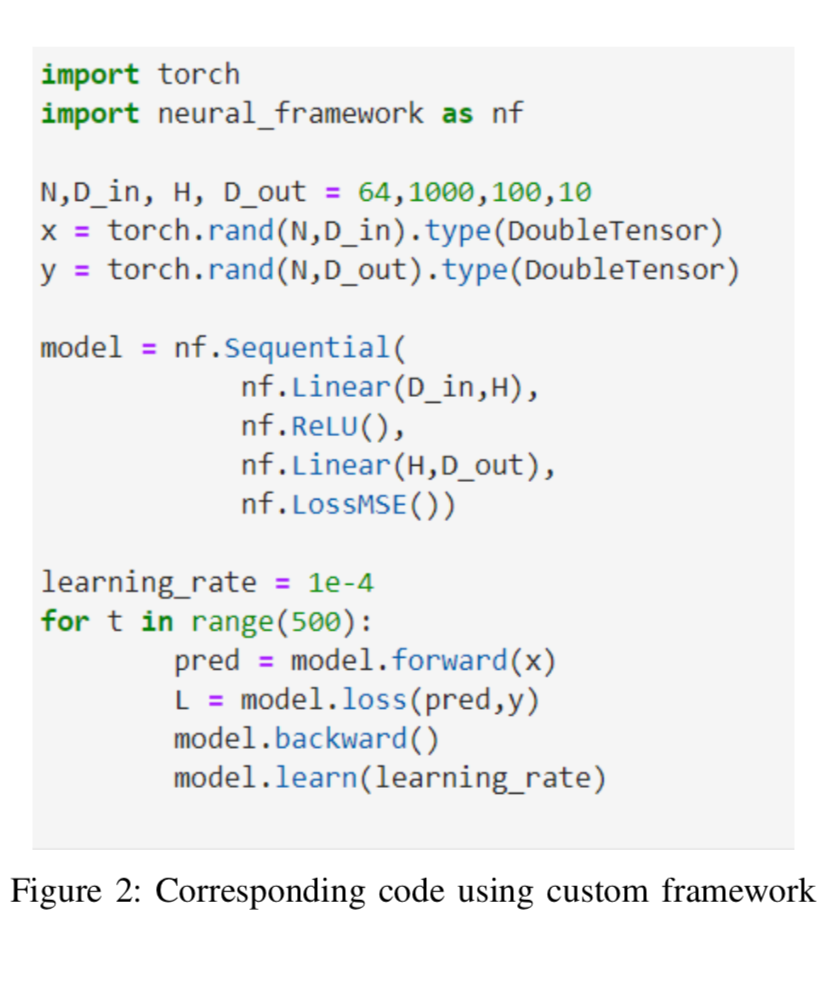

# **Description**
In order to develop the framework, we decide to use the code shown in Figure 1 as a guideline. In the example, both input data x and label data y are declared as variables, which represent nodes in a computational graph storing both data and gradients.

The model is defined with a sequential module from torch.nn which has linear layers (with different nodes) and activation functions as arguments. The loss is defined separately (in this case it is the Mean Squared Error). The network training is inside a for-loop, where several steps occur in each iteration:
*  Feed-forward → y pred = model(x)
*  Loss computation → loss = loss f n(y pred, y)
*  Back-propagation → loss.backward()
*  Parameter optimization → data− = learn rate∗grad

It is worth mentioning that before the back-propagation, the function zero grad has to be called. This function we set the gradients to zero before starting to do back- propagation because PyTorch accumulates the gradients on subsequent backward passes

After having analysed the ”conventional” way of defining a neural network, we select which things we want to emulate and which ones we want to change. In Figure 1, the corresponding code using neural framework.py is shown for comparison purposes. The input data and labels are defined as tensors instead of variables given that the module autograd cannot be imported.
The framework is based on the parent class Module, which is composed of three methods:
• forward → computes next feed-forward data tensor
• backward → computes next backward gradient tensor
• param() → returns parameters (weights and biases)
We like the idea of the model definition using the sequential module so we opt for also including the loss definition as a module inside the model. Finally, the 4 steps of neural network training (feed-forward, loss computation, back- propagation and parameter optimization) are made more in- tuitive given that they each have an associated method in the sequential model: forward(), loss(), backward(), learn()
